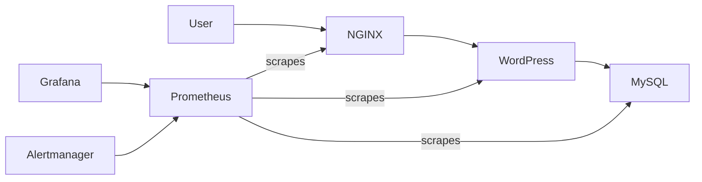

# HelmFlow — Production-Ready WordPress on Kubernetes

**Helm • Kubernetes • Custom Docker Images • Nginx (OpenResty) • MySQL • Prometheus • Grafana • Alertmanager**

---

## Overview

**HelmFlow** is a production-style WordPress deployment on Kubernetes, built to demonstrate how real-world DevOps teams package, deploy, configure, and monitor applications using **Helm**.

This project focuses on:
- Converting raw Kubernetes YAML into a **reusable Helm chart**
- Supporting **multiple environments (dev / prod)** using Helm values
- Running **stateful workloads** with persistent storage
- Adding **observability** using Prometheus, Grafana, and Alertmanager

This is a **hands-on, industry-aligned project**, not a toy example.

---

##  Key Objectives

- Build a reusable Helm chart for a multi-service application
- Support multiple environments using Helm values files
- Use custom Docker images instead of prebuilt charts
- Implement production-style Kubernetes patterns
- Add monitoring and alerting for visibility

---

##  Architecture



---

##  Features

- WordPress (PHP-FPM) deployed on Kubernetes
- MySQL backend with persistent storage
- OpenResty (NGINX + Lua) reverse proxy
- Helm-based deployment with reusable templates
- Environment-specific configuration using values files
- Prometheus metrics scraping
- Grafana dashboards for application and pod metrics
- Alertmanager integration for alerting

---

##  Repository Structure

```
.
├── charts/
│   └── wordpress/
│       ├── Chart.yaml
│       ├── values.yaml
│       ├── values-dev.yaml
│       ├── values-prod.yaml
│       └── templates/
│           ├── _helpers.tpl
│           ├── deployment-mysql.yaml
│           ├── deployment-nginx.yaml
│           ├── deployment-wordpress.yaml
│           ├── pvc-mysql.yaml
│           ├── pvc-wordpress.yaml
│           ├── configmap-nginx.yaml
│           ├── service-nginx.yaml
│           ├── service-wordpress.yaml
│           └── service-mysql.yaml
├── docker/
│   ├── mysql/
│   ├── wordpress/
│   └── nginx-openresty/
└── docs/
    ├── metrics.md
    └── monitoring-setup.md
```

---

## ✔ Prerequisites

- Kubernetes cluster (Docker Desktop / Minikube / Kind)
- Helm 3.x installed
- kubectl installed and configured
- Docker & Docker Hub account
- Git

---

##  Setup Instructions

### Step 1 — Clone the Repository

```bash
git clone <repo-url>
cd <repo>
```

---

### Step 2 — Build Docker Images

```bash
docker build -t <dockerhub-user>/wordpress:latest ./docker/wordpress
docker build -t <dockerhub-user>/mysql:latest ./docker/mysql
docker build -t <dockerhub-user>/nginx-openresty:latest ./docker/nginx-openresty
```

---

### Step 3 — Push Images

```bash
docker push <dockerhub-user>/wordpress:latest
docker push <dockerhub-user>/mysql:latest
docker push <dockerhub-user>/nginx-openresty:latest
```

---

##  Deploy Using Helm

### Development Environment

```bash
helm install blog-dev charts/wordpress -f charts/wordpress/values-dev.yaml
```

### Production Environment

```bash
helm install blog-prod charts/wordpress -f charts/wordpress/values-prod.yaml
```

Verify:

```bash
kubectl get pods
kubectl get svc
kubectl get pvc
```

---

##  Access WordPress

```bash
kubectl port-forward svc/blog-wordpress-nginx 8080:80
```

Open in browser:

    http://localhost:8080

---

##  Monitoring Setup

### Install kube-prometheus-stack

```bash
helm repo add prometheus-community https://prometheus-community.github.io/helm-charts
helm repo update
helm install monitoring prometheus-community/kube-prometheus-stack -n monitoring --create-namespace
```

---

## Access Grafana

```bash
kubectl get secret monitoring-grafana -n monitoring -o jsonpath="{.data.admin-password}" | base64 --decode
kubectl port-forward svc/monitoring-grafana 3000:80 -n monitoring
```

Open:

    http://localhost:3000  
Login: `admin / <password>`

---

## Example PromQL Queries

**Pod CPU**
```
sum(rate(container_cpu_usage_seconds_total{namespace="default"}[2m])) by (pod)
```

**Pod Memory**
```
sum(container_memory_usage_bytes{namespace="default"}) by (pod)
```

**NGINX Requests**
```
sum(rate(nginx_ingress_controller_requests_total[1m])) by (status)
```

**NGINX 5xx Errors**
```
sum(rate(nginx_ingress_controller_requests_total{status=~"5.."}[2m]))
```

---

## Troubleshooting

| Issue | Resolution |
|-----|------------|
| NGINX CrashLoop | Check ConfigMap mount path |
| WordPress not loading | Verify service & port-forward |
| Grafana shows no data | Check Prometheus targets |
| PVC pending | Verify storage class |

---

## Cleanup

```bash
helm uninstall blog-dev
helm uninstall blog-prod
helm uninstall monitoring -n monitoring
kubectl delete ns monitoring
```

---

## Future Enhancements

- Horizontal Pod Autoscaler (HPA)
- HTTPS with Ingress + Cert-Manager
- CI/CD pipeline integration
- Secrets management

---

## Maintainer

**Vivek Shaurya**  
GitHub: **mrperfect0603**


---

If you found this project helpful, feel free to fork, star, and contribute!\
Love 💙 & Peace ☮️
